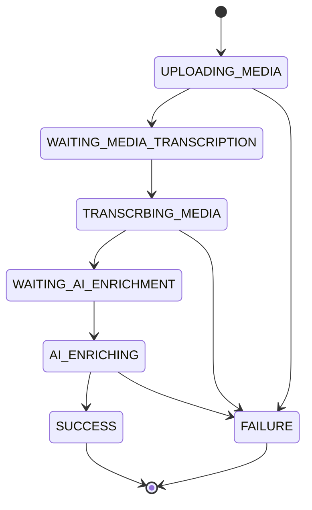
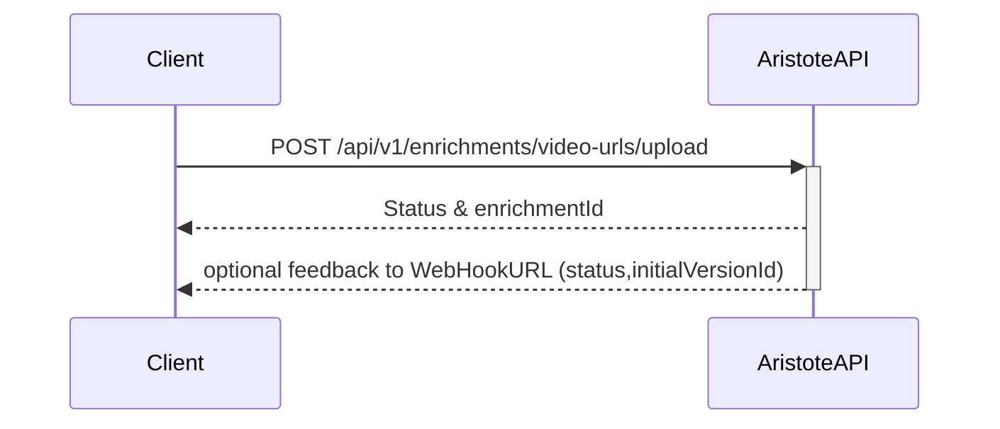
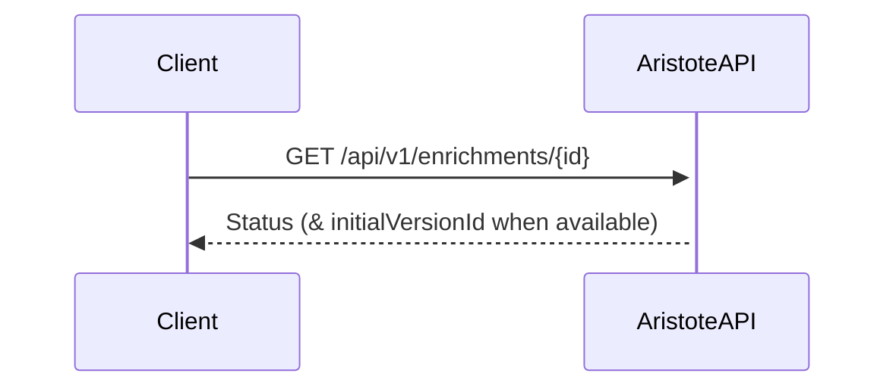
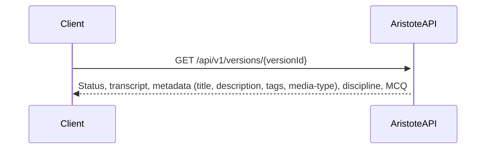
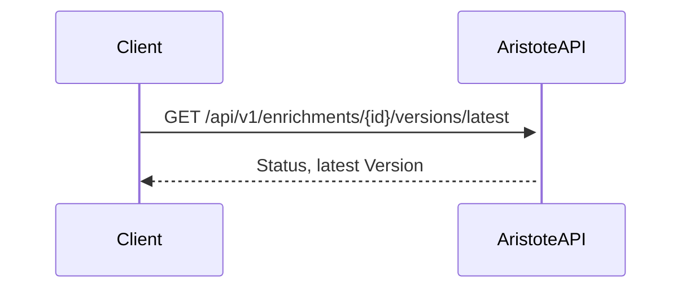
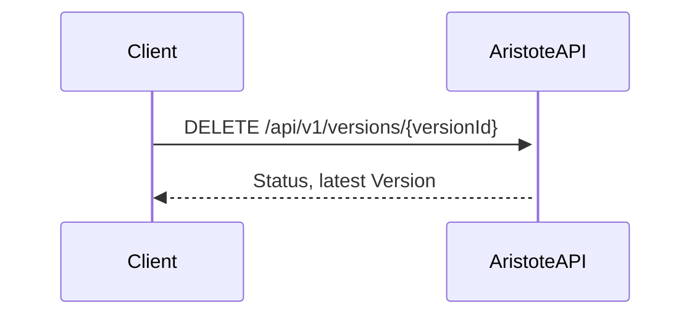

# Project actors, components and termminology

**Aristote** is an AI infrastructure which helps enrich pedagogical contents such as videos, providing automatic metadata and MCQ generation. It is made available through the use of the **AristoteAPI**.

An **AristoteAPI** `client` is a piece of software implemented in an edTech solution such as an on-demand video platform. The `client` implements the **AristoteAPI** in order to get enriched data from a source `Media`.

Posting a `Media` to the **AristoteAPI** creates an `Enrichment` object which will be processed by **Aristote's workers**.

The source `Media` is usually a video file (or most probably an URL to a video file), but other media will be supported in the future. The `Enrichment` of the `Media` made by the **Aristote's workers** consists of:
- generated metadata such as a title, a description text, tags, and classification into a list of media-types and disciplines whose possible values are given by the `client`.
- a transcription for Video and/or audio files
- an MCQ

The result of an `Enrichment` is called a `Version`, and the `Version`produced by the AI is called an `InitialVersion`.

`Enrichments` by AI are very usefull and time savers but are not perfect. It is important that the edTech product, in which the **AristoteAPI** `client` is integrated, implements a user interface to let the end user correct the generated output. In order to improve **Aristote AI**, it is also important the the corrected `Version` is posted by the `client`using the **AristoteAPI**

# Client API Charts

## Posting a `Media` and creating an `Enrichment`
The first step is to post a media to be processed by **Aristote**.

The *client* can post the URL of a video to create an `Enrichment`.
**Aristote** returns immediately an `Id` for this `Enrichment` and a status `WAITING_MEDIA_UPLOAD`.

**Aristote's workers** will then process the `Enrichment`:
- the **media worker** will download the media, and the `Enrichment` status will change to `UPLOADING_MEDIA` then `WAITING_MEDIA_TRANSCRIPTION`
- the **transcription worker** will process the video and the enrichment status will change to `TRANSCRBING_MEDIA` then to `WAITING_AI_ENRICHMENT`
- the **AI worker** will then process the `Enrichment` and its status will switch to `AI_ENRICHING` and then to `SUCCESS` or `FAILURE`
- Failure can occur at several steps

Here is a basic state diagram of the statuses for the `Enrichment`:

When the `Enrichment` has been processed, either successfully or with failure, an optional call to a *client* `Webhook` is made to notify the creation or failure of the `Enrichment`:

## Getting the status of `Enrichments`
At anytime a *client* can request the status of an `Enrichment` and **AristoteAPI** will answers if the *identity of the client* corresponds to the **owner** of the `EnrichmentId` provided:

At anytime a *client* can request the list of `Enrichments` and **AristoteAPI** will answers with the list of `Enrichments` **owned by** this particular `client`:

## Getting the content of an `Enrichment`'s `Version`
The result of an `Enrichment` is called a `Version`.
A successfully processed `Enrichment` containes an initial `Version` identified by and an `initialVersionId`.

The *client* can get the content of a `Version` by calling the `AristoteAPI`:

## Managing multiple `Enrichment` `Versions`

The initial `Version` is the one produced by the AI, but the end user may want to correct the output. For instance fixing bad tags, fixing classification into media types or disciplines, or changing questions and/or answers of the MCQ.

The `client` must push the proposed corrections made by the end user un a new `Version` by using the  **AristoteAPI**:

The `client` may get the list of `Versions` of a particular `Enrichment`:

The `client` may get the latest `Version` of a particular `Enrichment`:

The `client` **owning** an `Enrichment` may delete a `Version` if it's not the `InitialVersion`:

